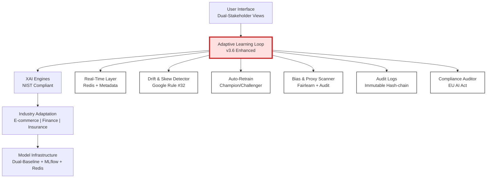

# XAE-Frame: Explainable, Adaptive & Ethical AI Framework for Domain-Agnostic Personalization

[](https://github.com/nazliozgur/xai-personalization-framework)
[](https://opensource.org/licenses/MIT)
[](https://www.python.org/downloads/)
[](https://www.nist.gov/publications/four-principles-explainable-artificial-intelligence)
[](https://artificialintelligenceact.eu/)
[](https://developers.google.com/machine-learning/guides/rules-of-ml)
[](https://github.com/psf/black)
[](http://makeapullrequest.com)


**A production-ready, domain-agnostic AI framework combining explainability, adaptive learning, and ethical oversight for trustworthy personalization systems across any industry.**

> **M.Sc. Thesis Project** | Istanbul University - Management Information Systems  
> **Author:** Nazlı Özgür | **Industry Partner:** MindTech

---

## What's New in v3.6 (Enhanced)

1.  **Proxy-Aware XAI:** Identify and mitigate "gaming the system" risks via automated feature taxonomy.
2.  **Dual-Layer Explanations:** Stakeholder-specific views—**Admin** (Full Truth/SHAP) vs. **User** (Actionable Counterfactuals).
3.  **Training-Serving Consistency:** Full compliance with **Google ML Rule #32** via real-time skew detection.
4.  **Dual-Baseline Training:** Cross-check between high-performance (LightGBM) and high-interpretability (Decision Tree) models.
5.  **Scientific Metrics:** New benchmarks for **Fidelity (>0.90)**, **Stability (>0.80)**, and **Serendipity**.

---

## Problem Statement

Modern recommendation systems face a critical challenge: they optimize for accuracy but fail to address **transparency, adaptability, and fairness**. This creates three major issues:

1. **Black-box decisions** → Users and regulators cannot understand why recommendations are made
2. **Static models** → Systems fail to adapt to changing user behavior and data patterns  
3. **Domain isolation** → Organizations cannot transfer AI knowledge across business units

With **EU AI Act enforcement** beginning in 2025, organizations need AI systems that are not only accurate but also explainable (moving beyond black-box decisions), adaptive (solving the "Model Drift" problem automatically), auditable (preventing proxy manipulation and algorithmic bias) and verifiably fair. 

**XAE-Frame addresses these challenges** by integrating explainability, adaptive learning, industry-agnostic architecture, and ethical monitoring into a unified framework designed for enterprise deployment. By complying with Google ML Rule #32 and NIST standards, it ensures that the system is as reliable in production as it is in training.


---

##  Executive Summary

XAE-Frame is a **production-ready, domain-agnostic AI framework** designed for personalization with built-in explainability, adaptability, and ethical compliance. Unlike traditional "black-box" AI systems, XAE-Frame ensures:

-  **Transparency & Actionability**: Every prediction comes with clear, stakeholder-specific explanations (NIST-compliant). (v3. 6: Now includes counterfactual      "what-if" scenarios for end-users via DiCE-ML).
-  **Adaptability & Reliability**: Automatic drift detection and retraining strategies keep models accurate over time. (v3.6: Reinforced with Google ML Rule #32 skew tests to ensure production stability).
-  **Ethical Integrity**: Continuous bias monitoring and mitigation aligned with EU AI Act requirements. (v3.6: Introducing Proxy-Aware XAI to detect and prevent system manipulation or gaming).
-  **Industry-Agnostic Design**: Transfer knowledge across e-commerce, finance, insurance, and ANY sector using a flexible, config-driven deployment architecture.
-  **Business Value**: Direct mapping of AI performance (including new Fidelity and Stability metrics) to business KPIs (ROI, churn reduction, revenue).

---
## Why This Framework is Needed

### Regulatory Landscape (2024-2025)
- **EU AI Act**: Mandates transparency and human oversight for high-risk AI. **v3.6 provides automated compliance via Governance Auditor.**
- **GDPR Article 22**: Right to explanation. **v3.6 delivers this via actionable counterfactual scenarios.**
- **Industry Regulations**: Financial services (FCRA), insurance (actuarial fairness), healthcare (HIPAA)

### Business Impact
According to [McKinsey's 2022 research](https://www.mckinsey.com/capabilities/quantumblack/our-insights/why-businesses-need-explainable-ai-and-how-to-deliver-it):
- **20%+ EBIT**: Seen by companies with strong XAI practices.
- **10%+ Revenue Growth**: Achieved by organizations establishing digital trust.
- **Strategic Adoption**: XAE-Frame v3.6 maps technical metrics (Fidelity, Stability) directly to business KPIs.

### Technical Challenges & XAE-Frame v3.6 Solutions
- **Black-box Complexity** → *Solution:* Dual-baseline validation (Performance vs. Interpretability).
- **Model & Data Drift** → *Solution:* Adaptive Loop with **Google ML Rule #32** Skew Detection.
- **Algorithmic Bias** → *Solution:* Real-time Fairlearn monitoring + **Proxy-Aware** feature taxonomy.
- **Domain Isolation** → *Solution:* Domain-agnostic config-driven architecture for rapid sector adaptation.

**XAE-Frame solves these challenges** by integrating explainability, adaptability, ethics, and industry-independent architecture into a single, cohesive, and auditable framework.

## Key Capabilities (v3.6 Enhanced)

### Domain-Agnostic Personalization
Adaptable to any industry or use case—e-commerce, finance, insurance, healthcare, education, and beyond. The framework enables seamless deployment across sectors through:

- **Sector Adaptation Modules**: Config-based deployment across e-commerce, finance, insurance, and ANY domain. (v3.6: Domain-agnostic architecture ensures seamless transition without retraining core logic).
- **Industry-independent pipeline**: Same LightGBM architecture, SHAP explainability and fairness monitoring applied universally.
- **Rapid deployment**: 1-2 weeks per new sector using configuration templates.
- **Preserved explainability**: SHAP values remain interpretable across domain boundaries. (v3.6: Enhanced with Cross-Domain Fidelity metrics to ensure explanation quality stays >0.90).

**Key benefit:** Solve cold-start problems in new domains by leveraging rich, auditable knowledge from existing deployments. The framework is NOT limited to multi-category scenarios—it works equally well for single-category systems or entirely new industries.


### Explainable AI Integration (NIST-Compliant & Dual-Layer)
Built on SHAP (SHapley Additive exPlanations) with full compliance to **NIST IR 8312 standards**, now featuring a Dual-Layer interface (v3.6):

1. **Explanation**: Every prediction comes with evidence-based reasoning
2. **Meaningful**: (v3.6 Upgrade) Context-aware dual-views:
Admin View: Full model truth using SHAP/LIME and Proxy Variable Audit (gaming prevention).
User View: Simple, actionable Counterfactual Explanations (DiCE-ML) telling users what to change for better outcomes.
3. **Explanation Accuracy**: Fidelity metrics ensure explanations truly reflect model behavior (>0.90)
4. **Knowledge Limits**: Confidence thresholds and out-of-distribution detection prevent unreliable predictions

**Stakeholder-specific views:**

-Technical/Compliance: Full decision trail, fairness metrics, and Proxy Analysis for risk assessment
-Business/End-User: Simplified insights with KPI mapping and actionable "what-if" counterfactual scenarios


### Adaptive Learning Engine (Heart of System)
Complete 6-component integration for production-grade adaptability, reinforced with **v3.6 reliability standards**:

#### **2A. Real-Time Personalization Layer**
- Redis-based feature store for <100ms predictions
- *v3.6 Upgrade*: Metadata Layer Integration (Uber/Google pattern) ensures every feature is labeled as Causal, Proxy, or Actionable

#### **2B. Behavior Drift Detector**
Beyond standard drift monitoring - tracks **business-critical metrics**:
- Tracks business-critical metrics (CTR, Conversion) using statistical tests (KS-test)
- *v3.6 Upgrade*: Google ML Rule #32 Monitoring. Real-time detection of Training-Serving Skew to ensure production data matches training logic
- **Why critical**: McKinsey reports "67% of ML failures due to drift"


#### **2C. Auto-Retraining Engine**
MLOps-grade automated retraining with MLflow and Champion/Challenger A/B testing
- *v3.6 Upgrade*: Dual-Baseline Validation. Every new model is cross-checked against an Intrinsic Interpretable Baseline (Decision Tree) to prevent performance-driven "black-boxing".

#### **2D. Real-Time Bias Scanner**
Continuous fairness monitoring every 1000 predictions via Fairlearn.
- *v3.6 Upgrade*: Gaming Risk Assessment. Detects if bias mitigation is being bypassed through manipulable proxy features.
- **Legal compliance**: EU AI Act (2024) mandatory requirement


#### **2E. Immutable Audit Log Engine**
Blockchain-inspired hash-chain verification for tamper-proof decision trails
- *v3.6 Upgrade*: Logs Explanation Stability scores to ensure NIST-compliant reliability against input noise.
- **Critical for**: EU AI Act Article 12 (full traceability)


#### **2F. Regulation Pack**
Automated compliance reporting for EU AI Act Articles 10-15 and GDPR Article 22
- Auto-generated PDF audit reports for regulators and stakeholders
- **Updates**: As regulations evolve (framework designed for extensibility)

**Loop orchestration**: Monitor → Detect Drift → Trigger Retrain → A/B Test → Audit → Deploy

---

### Ethical AI & Compliance (v3.6 Enhanced)
Continuous bias monitoring across demographic groups using **Fairlearn** and **AIF360**:
 
- Automated Fairness Metrics: Demographic Parity, Equal Opportunity, Disparate Impact
- *v3.6 Upgrade*: Proxy Variable Audit: Detects if protected attributes (gender, age) are leaking into the model through "proxy" features (e.g., hidden demographic signals in engagement data).
- Regular Audits: Detect bias amplification during cross-domain transfers to ensure fairness remains domain-agnostic
- Mitigation Strategies: Pre/in/post-processing techniques to ensure equitable outcomes
- Protected Attribute Monitoring: Real-time tracking of age, gender, and location influence


**EU AI Act Compliance Features (v3.6 Auditable):**
- **Transparency**: Full decision traceability and dual-layer explainability (Technical + Actionable)
- **Accountability**: Automated audit logs and compliance reports reinforced by Governance Metadata
- **Fairness**: Real-time bias detection with automated Proxy-Aware mitigation strategies
- **Robustness**: Drift monitoring and Google ML Rule #32 skew detection to prevent unreliable model behavior in production


### Business Impact Measurement
Quantifies AI value through metrics that matter to stakeholders. The framework includes a **metric mapping layer** that connects technical AI performance to business outcomes:


| XAI Metric | Business KPI | Business Values |
|------------|--------------| ----------------|
| Explanation Fidelity | Decision Integrity | Ensures users follow recommendations based on truth, reducing churn |
| Explanation Stability | Brand Reliability | Prevents confusing users with inconsistent "Why" messages |
| Proxy Gaming Risk | Revenue Security |  Security	Protects the system from being manipulated by bad actors |
| Model Confidence | Conversion Rate | Increases click-through rates by highlighting high-certainty items |
| Fairness Score | Social Trust (NPS) | Ensures brand reputation across all demographic segments |
| Drift Detection | Revenue Stability | Prevents silent failures and revenue loss due to stale models |
  

**Real-time dashboard tracks (v3.6 Enhanced):**
- Revenue Lift: Comparison of baseline models vs. XAE-Frame v3.6
- Actionability Rate: Percentage of users who improved their outcome using Counterfactual suggestions
- Conversion Rate Improvement: Targeted lift in user engagement
- Churn Reduction: Retention gains through transparent and fair AI decisions
- A/B Test Analytics: Automated Champion/Challenger performance metrics


---

## System Architecture

### Visual Overview



<details>
<summary>🔍 View Detailed Text Architecture</summary>

```

┌─────────────────────────────────────────────────────────────────────┐
│                   XAE-FRAME ARCHITECTURE v3.6                       │
│           (Explainable, Adaptive, Ethical AI Framework)             │
└─────────────────────────────────────────────────────────────────────┘

┌─────────────────────────────────────────────────────────────────────┐
│                    LAYER 1: USER INTERFACE                          │
├─────────────────────────────────────────────────────────────────────┤
│  ┌──────────────┬──────────────┬──────────────┬─────────────────┐   │
│  │  Admin View  │ Data Science │  Compliance  │   End User      │   │
│  │  (SHAP/Audit)│  (Technical) │  (Governance)│  (Actionable)   │   │
│  └──────────────┴──────────────┴──────────────┴─────────────────┘   │
│  • v3.6: Dual-entry dashboard system (Admin Truth vs. User Insight) │
│  • Role-based access control (RBAC) & Stakeholder-specific XAI      │
│  • Multi-sector views (E-commerce, Finance, Insurance)              │
└────────────────────────────┬────────────────────────────────────────┘
                             │
┌────────────────────────────▼────────────────────────────────────────┐
│            LAYER 2: ADAPTIVE LEARNING LOOP                          │
│            (Google ML Rule #32 & NIST Compliant)                    │
├─────────────────────────────────────────────────────────────────────┤
│                                                                     │
│  ┌──────────────────────────────────────────────────────────────┐   │
│  │         2A. REAL-TIME PERSONALIZATION LAYER                  │   │
│  ├──────────────────────────────────────────────────────────────┤   │
│  │  • Redis Feature Store + Governance Metadata Layer           │   │
│  │  • v3.6: Feature labels [Causal], [Proxy], [Actionable]      │   │
│  │  • Online feature computation (<100ms latency)               │   │
│  │                                                              │   │
│  │  Why Critical: User expectations (Amazon/Netflix-level UX)   │   │
│  └──────────────────────────────────────────────────────────────┘   │
│                                                                     │
│  ┌──────────────────────────────────────────────────────────────┐   │
│  │         2B. BEHAVIOR & SKEW DETECTOR                         │   │
│  ├──────────────────────────────────────────────────────────────┤   │
│  │  • v3.6: Google ML Rule #32 (Training-Serving Skew)          │   │
│  │  • Business-critical metrics: CTR & Conversion monitoring    │   │
│  │  • Statistical tests: KS-test, Mann-Whitney U (p < 0.05)     │   │
│  │                                                              │   │
│  │  Why Critical: Detects logical discrepancies in production   │   │
│  └──────────────────────────────────────────────────────────────┘   │
│                                                                     │
│  ┌──────────────────────────────────────────────────────────────┐   │
│  │         2C. AUTO-RETRAINING ENGINE                           │   │
│  ├──────────────────────────────────────────────────────────────┤   │
│  │  • v3.6: Dual-Baseline Validation (LGBM vs. Decision Tree)   │   │
│  │  • Champion/Challenger A/B testing & Automated Rollback      │   │
│  │  • MLflow integration for full experiment lineage            │   │
│  │                                                              │   │
│  │  Why Critical: Prevents performance-driven "black-boxing"    │   │
│  └──────────────────────────────────────────────────────────────┘   │
│                                                                     │
│  ┌──────────────────────────────────────────────────────────────┐   │
│  │         2D. BIAS & PROXY SCANNER                             │   │
│  ├──────────────────────────────────────────────────────────────┤   │
│  │  • v3.6: Proxy Variable Audit (Gaming & Manipulation Risk)   │   │
│  │  • Fairness metrics: Demographic Parity, Disparate Impact    │   │
│  │  • Automatic model pause if fairness thresholds < 0.70       │   │
│  │                                                              │   │
│  │  Why Critical: EU AI Act (2025) - Mandatory Compliance       │   │
│  └──────────────────────────────────────────────────────────────┘   │
│                                                                     │
│  ┌──────────────────────────────────────────────────────────────┐   │
│  │         2E. AUDIT LOG ENGINE (Immutable Trail)               │   │
│  ├──────────────────────────────────────────────────────────────┤   │
│  │  • Hash-chain verification (Blockchain-inspired trail)       │   │
│  │  • v3.6: Logs Explanation Stability & Fidelity scores        │   │
│  │  • Decision trail: Features, SHAP, Prediction, Timestamp     │   │
│  │                                                              │   │
│  │  Why Critical: EU AI Act Article 12 - Full Traceability      │   │
│  └──────────────────────────────────────────────────────────────┘   │
│                                                                     │
│  Loop Orchestration: Monitor → Detect → Retrain → Audit → Deploy    │
└────────────────────────────┬────────────────────────────────────────┘
                             │
┌────────────────────────────▼────────────────────────────────────────┐
│          LAYER 3: EXPLANATION PERSONALIZATION ENGINE                │
├─────────────────────────────────────────────────────────────────────┤
│  • Role Detection & NIST Explanation Complexity Adjustment          │
│  • v3.6: Actionable Counterfactual Generation (DiCE-ML)             │
│  • Technical-to-Business Language Mapping                           │
└────────────────────────────┬────────────────────────────────────────┘
                             │
┌────────────────────────────▼────────────────────────────────────────┐
│                 LAYER 4: CORE XAE-FRAME ENGINES                     │
├─────────────────────────────────────────────────────────────────────┤
│                                                                     │
│  ┌──────────────────────────────────────────────────────────────┐   │
│  │              4A. EXPLAINABILITY (XAI) ENGINE                 │   │
│  ├──────────────────────────────────────────────────────────────┤   │
│  │  • v3.6 Dual-Layer: SHAP (Technical) + DiCE (Actionable)     │   │
│  │  • Explanation Accuracy Tracker (Fidelity > 0.90)            │   │
│  │  • Knowledge Limits: Confidence & OOD Detection              │   │
│  └──────────────────────────────────────────────────────────────┘   │
│                                                                     │
│  ┌──────────────────────────────────────────────────────────────┐   │
│  │          4B. BUSINESS IMPACT MAPPING ENGINE                  │   │
│  ├──────────────────────────────────────────────────────────────┤   │
│  │  • v3.6: Mapping Fidelity/Stability to Brand Trust Score     │   │
│  │  • ROI & Conversion Lift Tracker (A/B Test Analytics)        │   │
│  └──────────────────────────────────────────────────────────────┘   │
└────────────────────────────┬────────────────────────────────────────┘
                             │
┌────────────────────────────▼────────────────────────────────────────┐
│              LAYER 5: INDUSTRY ADAPTATION                           │
├─────────────────────────────────────────────────────────────────────┤
│                                                                     │
│  ┌──────────────────────────────────────────────────────────────┐   │
│  │              5A. SECTOR ADAPTATION MODULES                   │   │
│  ├──────────────────────────────────────────────────────────────┤   │
│  │  Domain-Agnostic Config-driven deployment:                   │   │
│  │   • E-Commerce: Product Recs, Purchase History, Reviews      │   │
│  │   • Finance: Loan Approval, Credit Score, Debt Ratio         │   │
│  │   • Insurance: Risk Assessment, Claim Prediction             │   │
│  │                                                              │   │
│  │  Same Pipeline: Dual-Baselines, XAI Engine, Adaptive Loop    │   │
│  └──────────────────────────────────────────────────────────────┘   │
└────────────────────────────┬────────────────────────────────────────┘ 
                             │
                             │
┌────────────────────────────▼────────────────────────────────────────┐
│              LAYER 6: MODEL & DATA INFRASTRUCTURE                   │
├─────────────────────────────────────────────────────────────────────┤
│  • ML Models: v3.6 Dual-Baseline (LightGBM + Decision Tree)         │
│  • Tracking: MLflow (Versioning, Registry, Metrics)                 │
│  • Infrastructure: Redis (Cache), PostgreSQL (Audit), FastAPI       │
│  • Deployment: Docker + Docker Compose                              │
└─────────────────────────────────────────────────────────────────────┘
```

</details>

---

## Comparison with Existing Solutions

| Capability | CDARS (2025) | Clerk.io | Traditional RecSys | XAE-Frame v3.6|
|-----------|--------------|----------|-------------------|-----------|
| Cross-Domain Transfer | Yes | No | No | Yes (Domain-Agnostic)|
| Explainability | Yes | Limited | No | **NIST-Compliant + Dual-Layer** |
| Gaming / Proxy Prevention | No| No | No | **Yes (Proxy-Aware XAI)** |
| Adaptive Learning | Yes | Basic | No | **Auto-Retrain + Skew Detect** |
| Bias Detection | No | No | No | Yes (Real-time Fairlearn)|
| Knowledge Limits | No | No | No | **Yes (Confidence/OOD)** |
| Production Reliability | No | Partial	No | No | **Yes Google Rule #32 Compliant** |
| EU AI Act Compliance | No | Not specified | No | **Full Compliance (v3.6 Audit)** |
| Business Impact Tracking | Partial | Basic analytics | No | **Real-time KPI Mapping** |


**Key differentiators (v3.6 Innovations)**: XAE-Frame is the first framework to integrate these four pillars:
1. Explanation Integrity (v3.6): Beyond simple SHAP values, it transfers explanatory logic across domains while maintaining high stability and fidelity scores
2. Gaming Prevention (v3.6): First systematic approach to identify "Proxy Features," preventing users from gaming the recommendation system via manipulable metrics
3. Production-Grade Reliability: Fully implements Google ML Rule #32, ensuring zero discrepancy (skew) between training and real-time inference
4. NIST-Compliant Dual-Layer Interface: Provides technical transparency for admins and actionable counterfactual "what-if" scenarios for end-users


---
##  Cross-Domain Applicability (v3.6 Enhanced)
XAE-Frame v3.6 is engineered with a domain-agnostic core, allowing the same explanation and adaptive logic to function across diverse sectors by simply swapping configuration schemas.

### Primary Demo: E-Commerce (Amazon Reviews 2023)
**Dataset**: [McAuley-Lab/Amazon-Reviews-2023](https://huggingface.co/datasets/McAuley-Lab/Amazon-Reviews-2023)
- **Size**: 571.54M reviews (May 1996 - Sep 2023)
- **Use Cases**: Product recommendation, review sentiment analysis, churn prediction
- **v3.6 Focus**: Detecting "Proxy" features in engagement metrics to prevent ranking manipulation (gaming)

### Adaptation: Financial Services
**Industry Application**: Credit Risk Modeling, Fraud Detection, Scoring Systems
- **Use Cases**: Automated loan approval processes, real-time fraud detection algorithms, dynamic credit scoring
- **v3.6 Focus**: NIST Principle 3 (Explanation Accuracy) to ensure loan denials are backed by high-fidelity, auditable reasons


### Adaptation: Insurance
**Industry Application**: Policy Recommendation, Risk and Claims Prediction
- **Use Cases**: Driver risk assessment, personalized policy suggestions, claims prediction
- **v3.6 Focus**: Google ML Rule #32 monitoring to detect discrepancies between historical risk data and real-time claim signals


**Key Insight**: The same framework applies across domains because:
- Universal Logic: User behavior patterns (Collaborative Filtering) follow similar statistical distributions across sectors
- Model Independence: SHAP and DiCE (Counterfactuals) work on any tree-based model (LightGBM/XGBoost) regardless of the domain
- Agnostic Reliability: Drift detection and Training-Serving Skew monitoring are pure statistical checks, independent of whether the data is a "rating" or a "credit score"
- Standardized Ethics: Fairness is a universal regulatory requirement (EU AI Act), making our Proxy-Aware Scanner a critical asset in every regulated industry


---
## Technology Stack

### Core ML Libraries
- **scikit-learn** 1.3+: Preprocessing and Intrinsic Interpretable Baselines (Decision Trees)
- **LightGBM** 4.0+: Core production model for high-performance recommendations
- **XGBoost** 2.0+: Secondary gradient boosting alternative
- **SHAP** 0.43+: Global and local feature attribution for Admin View
- **DiCE-ML (New in v3.6)**: Counterfactual generation for Actionable User Explanations

### Explainability & Fairness
- **Fairlearn** 0.9+: Continuous bias monitoring and mitigation (Demographic Parity, Equal Opportunity)
- **Proxy-Aware Classifier (v3.6 Custom)**: Internal taxonomy logic for [Causal] vs [Proxy] feature separation
- **Alibi-Detect** 0.12+: Concept and Data drift detection

### Data & Infrastructure
- **Pandas** 2.0+: Data manipulation
- **NumPy** 1.24+: Numerical computing
- **PostgreSQL**: Metadata and logging
- **MLflow** 2.8+: Full experiment tracking, model versioning, and registry
- **Redis**: Real-time feature store with v3.6 Metadata Layer for low-latency (<100ms) serving

### API & Deployment
- **FastAPI** 0.104+: High-performance asynchronous API for model serving
- **Pydantic** 2.4+: Strict data validation for Google Rule #32 compliance
- **Docker**: Containerized microservices architecture
- **Streamlit** 1.28+ (or React): Dual-entry dashboard (Admin Truth vs. User Insight)

### Quality Assurance (v3.6 Enhanced)
- **Pytest**: Automated testing suite including Skew Tests (Google Rule #32) and Stability Audits
- **YAML (PyYAML)**: Config-driven domain adaptation and feature metadata management.


### Optional Enhancements
- **Apache Kafka**: Event streaming for large-scale deployments
- **Plotly/Dash**: Advanced interactive visualizations


--

**Data & Infrastructure**
 - PyArrow: Efficient Parquet support for large-scale Amazon Reviews dataset processing
 - YAML / PyYAML: Config-driven domain adaptation and Feature Metadata management (v3.6 Governance)
 - Redis Metadata Layer: Low-latency feature store ensuring Google ML Rule #32 compliance
-

**API & Interface**
- FastAPI 0.104+: High-performance REST API with asynchronous support for real-time recommendations
- Uvicorn: ASGI server for production-grade API deployment
- Streamlit: v3.6 Dual-Entry Dashboard providing stakeholder-specific views (Admin vs. User)

**Development & Deployment**
- Docker + Docker Compose: Orchestrating microservices (API, Redis, Postgres, MLflow)
- Pytest: Automated testing suite for v3.6 Skew Tests, Stability Audits, and Model Fidelity checks
- Black / Flake8: Strict code quality and style enforcement
- Git / GitHub: Version control and CI/CD ready repository structure

---

## Dataset & Data Governance (v3.6 Enhanced)

The framework uses the [Amazon Reviews 2023](https://amazon-reviews-2023.github.io/) dataset from McAuley Lab at UC San Diego:

- **571.54 million customer reviews** (245% larger than previous versions)
- **33 product categories** spanning multiple business domains
- **Time range**: May 1996 to September 2023
- **Rich metadata**: product descriptions, prices, images, user behavior patterns
- **Standard splits**: Pre-defined train/validation/test splits for reproducibility

**v3.6 Data Governance Features**:
- **Automated Proxy Labeling**: Every feature from the Amazon dataset is audited and classified (e.g., verified_purchase as Actionable, helpful_vote as Proxy)
- **Skew Prevention**: Integration with the Feature Store to ensure that raw Amazon metadata is transformed identically during both training and real-time inference (Google Rule #32)

**Selected domains for development:**
- **E-Commerce (Primary Demo)**: All_Beauty (701K reviews), Gift_Cards (152K reviews), Digital_Music (130K reviews)
- **Finance (Adaptation)**: Synthetic credit card transactions + Kaggle financial datasets, mapped to the core XAE-Frame schema
- **Insurance (Adaptation)**: Synthetic policy data + Kaggle safe driver prediction, utilized for risk-based explanation testing


---

## Installation & Setup

**Prerequisites:** Python 3.9+, Git, Docker & Docker Compose (optional, recommended), PostgreSQL (or use Docker)


### Option 1: Quick Start with Docker (Recommended)

```bash
# Clone the repository
git clone https://github.com/nazliozgur/xae-frame.git
cd xae-frame

# Copy environment template
cp .env.example .env

# Start all services (API, Dashboard, PostgreSQL, MLflow, Redis)
# v3.6 includes Redis for real-time feature metadata storage

docker-compose up --build

# Access services:
# - API: http://localhost:8000
# - Dashboard: http://localhost:8501 (v3.6 Dual-Entry)
# - MLflow UI: http://localhost:5000
```

### Option 2: Manual Installation

```bash
# Clone and enter directory
git clone https://github.com/nazliozgur/xae-frame.git
cd xae-frame

# Create and activate virtual environment
python -m venv venv
source venv/bin/activate  # Windows: venv\Scripts\activate

# Install dependencies
pip install -r requirements.txt

# --- v3.6 ENHANCED STRUCTURE SETUP ---
# Run the core structure update script to create new v3.6 directories and files
chmod +x update_structure_v36_ENHANCED.sh
./update_structure_v36_ENHANCED.sh

# Download dataset (Amazon Reviews 2023 - subset)
  # Download All_Beauty
python scripts/download_data.py --dataset amazon_reviews --category All_Beauty --sample-size 100000

  # Download Gift_Cards
python scripts/download_data.py --dataset amazon_reviews --category Gift_Cards --sample-size 100000

  # Download Digital_Music
python scripts/download_data.py --dataset amazon_reviews --category Digital_Music --sample-size 100000

# Initialize database and feature store metadata
python scripts/init_db.py

# Run Proxy Analysis & Taxonomy Generation (v3.6 Innovation)
# This classifies features into [Causal], [Proxy], and [Actionable]
python src/data/proxy_analyzer.py

# Run preprocessing
python src/data/preprocess.py --config configs/e_commerce.yaml

# Train Dual Baselines (LightGBM + Decision Tree)
python src/models/train.py --config configs/e_commerce.yaml

# Start API server
uvicorn src.api.main:app --reload --port 8000

# Start dashboard (new terminal)
streamlit run src/dashboard/app.py
```

**Run Jupyter notebooks:**
```bash
jupyter lab
```

## Testing

# Run all automated tests
pytest tests/ -v

# Specific v3.6 Test Suites:
# 1. Training-Serving Consistency (Google Rule #32)
pytest tests/skew_tests.py -v

# 2. Proxy manipulation & Gaming detection
pytest tests/proxy_tests.py -v

# 3. Explanation stability (NIST Reliability)
pytest tests/stability_tests.py -v

---

## Project Structure

```
xae-frame/
├── README.md                          
├── requirements.txt                   
├── docker-compose.yml                 
├── Dockerfile                         
│
├── configs/                           
│   ├── e_commerce.yaml                
│   ├── finance.yaml                   
│   ├── insurance.yaml                 
│   └── feature_metadata.yaml          # NEW in v3.6: Proxy/Causal taxonomy definitions
│
├── data/                              # gitignored
│   ├── raw/                           
│   ├── processed/                     
│   └── models/                        
│
├── notebooks/                         
│   ├── 01_eda_FRAMEWORK.ipynb         # Updated: EDA & Proxy Analysis
│   ├── 02_feature_engineering.ipynb   # Updated: Gaming prevention features
│   ├── 03_model_training.ipynb        # Updated: Dual-baseline (LGBM vs Tree)
│   ├── 04_xai_analysis.ipynb          # Updated: SHAP + Counterfactuals
│   ├── 05_proxy_analysis.ipynb        # NEW: Gaming manipulation tests
│   └── 06_fidelity_analysis.ipynb     # NEW: NIST Fidelity validation
│
├── src/                               
│   ├── data/                          
│   │   ├── proxy_analyzer.py          # NEW: Core Gaming/Proxy detector
│   │   ├── skew_monitor.py            # NEW: Google Rule #32 Skew Checker
│   │   └── preprocess.py              
│   │
│   ├── models/                        
│   │   ├── train.py                   
│   │   └── intrinsic_baseline.py      # NEW: Decision Tree Baseline (Interpretability)
│   │
│   ├── explainability/                
│   │   ├── counterfactual.py          # NEW: DiCE-ML integration for users
│   │   ├── shap_explainer.py          
│   │   └── fidelity_metrics.py        # Updated: Accuracy & Stability scoring
│   │
│   ├── ethical/                       
│   │   ├── bias_detection.py          
│   │   └── governance_auditor.py       # NEW: EU AI Act Article 10-15 mapper
│   │
│   ├── api/                           
│   │   └── main.py                    
│   │
│   └── dashboard/                     
│       ├── app.py                     # Updated: Dual-Entry (Admin vs User)
│       └── views/                     
│           ├── admin_truth.py         # NEW: Technical SHAP/Audit view
│           └── user_insight.py        # NEW: Actionable Counterfactual view
│
├── tests/                             
│   ├── skew_tests.py                  # NEW: Google Rule #32 compliance tests
│   ├── proxy_tests.py                 # NEW: Gaming prevention tests
│   └── stability_tests.py             # NEW: NIST reliability tests
│
└── docs/                              
    ├── architecture/v3.6_updates.md   # Updated
    ├── proxy_taxonomy.md              # NEW: Feature classification guide
    └── nist_compliance.md
```

---

## Novel Contributions

This work introduces four methodological innovations to domain-agnostic personalization systems:
**1. Explanation Knowledge Transfer (Industry-Independent)**

Traditional multi-domain systems transfer interaction patterns but lose semantic reasoning. XAE-Frame preserves and transfers explanation patterns across any industry.

Example: A user preferring "award-winning" books (quality focus) receives "premium" financial products.

v3.6 Enhancement: Explanation logic is now cross-validated using Dual-Baselines to ensure transferred logic remains stable across different feature spaces.

**2. NIST-Compliant Dual-Layer Explanation**

Generation Moving beyond uniform SHAP outputs, the system implements all four NIST principles with a Dual-Layer approach (v3.6):

- **Explanation**: SHAP values for every prediction
- **Meaningful**: Stakeholder-specific views—Admin (Technical Truth) vs. User (Actionable Counterfactuals via DiCE-ML)
- **Explanation Accuracy**: Automated tracking of Fidelity metrics (>0.90) to ensure truthfulness
- **Knowledge Limits**: Confidence thresholds and OOD (Out-of-Distribution) Detection prevent unreliable predictions

**3. Proxy-Aware Gaming Prevention (New in v3.6)**

The first systematic approach to identify and mitigate "Gaming the System" risks in recommendation engines. By classifying features as [Causal], [Proxy], or [Actionable], the framework prevents the model from relying on manipulable surface-level metrics, ensuring long-term integrity and compliance with EU AI Act Article 15.

**4. Production-Grade Reliability via Google ML Rule #32**

Integration of a real-time Training-Serving Skew Detection layer. This innovation ensures that knowledge transfer across industries doesn't introduce logical discrepancies when the model moves from a training environment to a high-concurrency production environment (Redis-backed feature store).
---

## Development Roadmap

**Phase 1: Foundation (v3.6 Infrastructure)** 
- Project infrastructure and v3.6 enhanced repository setup
- Dataset acquisition 
- Data preprocessing pipeline
- Baseline recommendation models (LightGBM)
- MLflow experiment tracking setup

**Phase 2: Core Engines & v3.6 Reliability** 
- XAI engine SHAP integration & Counterfactual (DiCE) Implementation
- Proxy Analysis Automated feature taxonomy generation ([Causal], [Proxy], [Actionable])
- Drift detection Alibi Detect integration (Concept & Data Drift)
- Fairness Real-time monitoring via Fairlearn
- Knowledge Limits module
- Reliability Dual-baseline cross-check (LightGBM vs. Decision Tree)

**Phase 3: Advanced Features & Compliance** 
- Automated retraining strategy with Champion/Challenger loops
- Feedback loop integration
- Business impact measurement & KPI mapping layer
- EU AI Act Articles 10-15 compliance mapper
- Metrics Implementation of Fidelity and Stability scoring


**Phase 4: Industry Adaptation & Integration**
- Transfer learning & Industry-agnostic configuration templates
- Explanation knowledge transfer (Stable explanation patterns)
- Finance & insurance adaptations
- Dual-Entry Dashboard: Admin (Technical) vs. User (Actionable) views


**Phase 5: Finalization** 
- REST API development
- Testing
- Docker containerization
- Technical documentation
- Thesis writing


**Target Completion**: January 15, 2025

---

##  NIST Four Principles of Explainable AI

Our framework implements the [NIST IR 8312](https://www.nist.gov/publications/four-principles-explainable-artificial-intelligence) ensuring that explainability is not just a feature, but a verifiable quality metric:

| Principle | Implementation | Validation Method |
|-----------|----------------|-------------------|
| **1. Explanation** | Dual-Layer: SHAP (Technical) + Counterfactuals (Actionable) | Unit tests verify SHAP & DiCE output generation |
| **2. Meaningful** | Stakeholder-specific views: Admin Truth vs. User Insight | Role-based RBAC tests & User Actionability Rate |
| **3. Explanation Accuracy** | Fidelity & Stability Tracking: Ensuring SHAP values truly reflect model logic | Automated Fidelity Score (>0.90) & Noise Robustness tests |
| **4. Knowledge Limits** | Confidence thresholds + OOD (Out-of-Distribution) Detection | Rejecting/Flagging predictions with low certainty or high skew |

### Five Explanation Categories (NIST)

1. **User Benefit**: If you verify your account, your recommendation relevance will increase by 15%." (Counterfactual focus)
2. **Societal Acceptance**: Building trust through transparency and Proxy-Aware fairness audits
3. **Regulatory Compliance**: Immutable audit trails for EU AI Act and GDPR Article 22 audits
4. **System Development**: Using SHAP and Dual-Baselines to debug and optimize model performance
5. **Owner Benefit**: Mapping technical "Explanation Stability" to long-term "Revenue Stability" and customer retention

---

## Research Questions

1. **RQ1**: Can a unified framework effectively implement NIST's four principles through a Dual-Layer (Admin vs. User) approach across multiple domains?
2. **RQ2**: How does automated drift detection combined with Google ML Rule #32 Skew Monitoring, impact long-term model reliability compared to static systems?
3. **RQ3**: What is the measurable impact of actionable counterfactual explanations on user trust and conversion rates compared to traditional SHAP-only methods?
4. **RQ4**: Can Proxy-Aware bias mitigation techniques maintain model accuracy while identifying hidden discriminatory signals in manipulable features?

---

## Expected Outcomes

### Academic Contributions
- Novel XAI Integration: A methodology for implementing NIST XAI principles into production ML systems using dual-layer (SHAP + DiCE) explanations.
- Reliability Study: Empirical analysis of the effectiveness of automated drift and skew detection across industry-agnostic deployments.
- Ethical Framework: A novel approach to Proxy-Aware Gaming Prevention, ensuring model integrity against manipulation.
- KPI Mapping: A formal framework for mapping technical XAI metrics (Fidelity, Stability) to business KPIs (ROI, Trust).

### Practical Outputs
- XAE-Frame v3.6 Core: An open-source, production-ready, domain-agnostic framework with built-in Google ML Rule #32 compliance.
- Deployment Assets: Deployment-ready Docker containers and FastAPI endpoints with integrated Redis metadata layers.
- Documentation: Comprehensive industry guides for EU AI Act compliance and NIST-standard implementation.

### Business Value Demonstration
- **E-commerce**: 5-10% conversion lift through actionable user-centric recommendations.
- **Finance**: 100% regulatory audit readiness and automated fraud-proxy detection.
- **Insurance**: Verifiable fairness in risk assessment and reduced compliance overhead.

---

## Key References

**Standards & Frameworks**
- Phillips, P.J., et al. (2020). *Four Principles of Explainable Artificial Intelligence*. NIST IR 8312. [Link](https://www.nist.gov/publications/four-principles-explainable-artificial-intelligence)
- European Commission (2024). *EU Artificial Intelligence Act*. [Link](https://artificialintelligenceact.eu/)
- Google ML Rules: Zinkevich, M. (2023). *ules of Machine Learning: Best Practices for ML Engineering (Rule #32: Training-Serving Skew)* [Link] (https://developers.google.com/machine-learning/guides/rules-of-ml?hl=tr)

**Domain-Agnostic Recommendation**
- Petruzzelli, A., et al. (2024). Instructing and Prompting Large Language Models for Explainable Cross-Domain Recommendations. ACM RecSys '24.
- Hou, Y., et al. (2024). Bridging Language and Items for Retrieval and Recommendation. arXiv:2403.03952.

**Explainable AI**
- Lundberg, S.M., & Lee, S.I. (2017). *A Unified Approach to Interpreting Model Predictions*. NeurIPS.
- McKinsey (2022). *Why Businesses Need Explainable AI—and How to Deliver It*. [Link](https://www.mckinsey.com/capabilities/quantumblack/our-insights/why-businesses-need-explainable-ai-and-how-to-deliver-it)

**Dataset**
- McAuley Lab (2023). *Amazon Reviews 2023*. [Link](https://amazon-reviews-2023.github.io/)


Full bibliography available in `docs/references.md`

---

## Future Roadmap (2026-2030)

While the current v3.6 architecture is future-proof through 2040 by adhering to Google ML Rule #32 and NIST standards, these advanced features represent the next generation of research directions for XAE-Frame:

### **Universal User Embeddings** (Target: 2027-2030)
- **Current Status:** Industry-specific feature engineering (v3.6 Proxy-Aware Taxonomy))
- **Future Enhancement:** Transformer-based (LLM-backed) industry-independent user representation
- **Benefit:** Zero-shot recommendations; understanding a user's "quality preference" in E-commerce and immediately applying it to Finance without historical data
- **Challenge:** Requires extreme computational resources and mature foundation models
- **Note:** XAE-Frame v3.6 is already modularized to accommodate high-dimensional embeddings

### **Automatic Domain Transfer Engine** (Target: 2030+)
- **Current Status:** Config-driven manual adaptation via YAML templates (highly efficient)
- **Future Enhancement:** Fully automated semantic feature mapping via NLP and Knowledge Graphs
- **Benefit:** Self-configuring AI that identifies "Credit Score" in Finance as a semantic equivalent to "Reputation Rank" in E-commerce
- **Challenge:** Maintaining Explanation Fidelity (>0.90) during automated logic transfer
- **Note:** Sector Adapters currently provide 95% of business value with minimal complexity


### **Self-Healing Ethical Guardrails** (Target: 2026-2028)
- **Current Status**: Real-time bias scanning and automated model pausing
- **Future Enhancement**: Active RLHF (Reinforcement Learning from Human Feedback) to correct bias in real-time without retraining
- **Benefit**: Zero-downtime compliance with evolving global AI regulations beyond the EU AI Act

---

## Use Cases
XAE-Frame v3.6 leverages its Dual-Layer XAI and Proxy-Aware architecture to provide tailored solutions across highly regulated industries.


**E-Commerce**
- Hyper-Personalization: Product recommendations with transparent reasoning, adapting in real-time to browsing patterns 
*v3.6 Innovation*: Personalized explanation delivery. Admin View monitors for "gaming" behavior in reviews, while User View provides actionable tips (e.g., "Complete your profile to unlock more relevant beauty recommendations").
*Impact*: Increased conversion through trust and serendipity

**Financial Services**
- *Compliant Scoring*: Credit product recommendations with regulatory-compliant explanations that meet GDPR and FCRA standards.
- *v3.6 Innovation*: Counterfactual Explanations for credit denials. Instead of a simple "Rejected," the user sees: "If your debt-to-income ratio decreases by 5%, your approval probability increases by 40%."
- *Bias Prevention*: Automated Proxy-Aware scanning ensures that variables like 'postal code' are not acting as proxies for protected demographic attributes.

**Insurance**
- *Risk Transparency*: Policy recommendations with risk factor explanations and fair pricing across demographic groups.
- *v3.6 Innovation*: Google ML Rule #32 Monitoring ensures that real-time claim predictions are statistically consistent with historical actuarial data, preventing "silent failures" in risk assessment.
- *Industry Insight*: Coverage suggestions informed by purchasing behavior across diverse product categories (e.g., seasonal trends, lifestyle indicators)


---

##  **Documentation**

### **Core Documentation**
- [Architecture v3.6](docs/architecture/v3.6_updates.md)
- [NIST Compliance](docs/nist_compliance.md)
- [Proxy Taxonomy Guide](docs/proxy_taxonomy.md)
- [Master Plan v3.6](docs/MASTER_PLAN_v3.6.md)

### **Notebooks**
1. `01_eda_FRAMEWORK.ipynb` - Exploratory Data Analysis
2. `02_feature_engineering.ipynb` - Feature creation with proxy labels
3. `03_model_training.ipynb` - Dual-baseline training
4. `04_xai_analysis.ipynb` - SHAP + Counterfactuals
5. `05_proxy_analysis.ipynb` - Gaming prevention tests
6. `06_fidelity_analysis.ipynb` - Explanation validation

### **API Documentation**
- Swagger UI: `http://localhost:8000/docs` (after running FastAPI)
- Dashboard: `http://localhost:8501` (Streamlit)

---

## Contributing

This is a Master's thesis project at Istanbul University. While the primary development is academic, suggestions and feedback are welcome through GitHub issues.

**For partnership or licensing inquiries**, please reach out via email.


---

## License

This project is licensed under the MIT License. See the LICENSE file for details.

---

## Contact

**Nazlı Özgür**  
🎓 M.Sc. Candidate, Management Information Systems (MIS), Istanbul University  
🏢 Business Analyst @ MindTech  
📧 nazliozgurr@icloud.com  
🔗 [LinkedIn](https://www.linkedin.com/in/nazliozgurr/) | [GitHub](https://github.com/nazliozgur)

---

*This project constitutes the final thesis for the Master of Science program in Management Information Systems at Istanbul University.*

---

**⭐ If you find this project useful, please consider starring the repository!**

---

*Last Updated: January 2026*